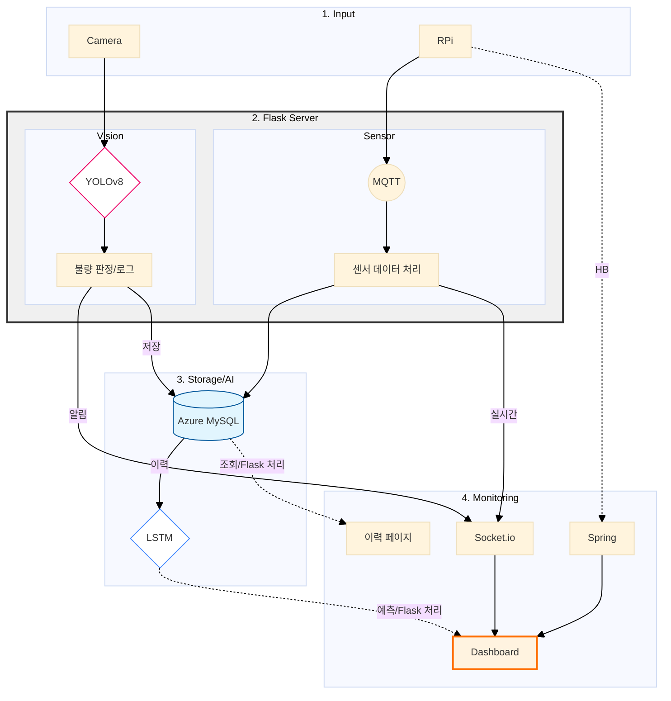

# 🕷 S.P.I.D.E.R  
### Smart Predictive & Integrated Defect Evaluation Robot

S.P.I.D.E.R는 스마트팩토리 환경에서 **설비 센서 데이터와 이미지 데이터를 통합 분석**하여  
설비 이상을 사전에 감지하고, 제품 불량을 실시간으로 검출하는  
**AI 기반 통합 예지보전 · 품질 검사 시스템**입니다.

실시간 데이터 수집부터 AI 기반 분석, 웹 대시보드 시각화까지  
하나의 흐름으로 연결된 구조를 목표로 설계되었습니다.

[🔗 Flask Github](https://github.com/betterproject-dev/spider_flask)  -  Python 기반 데이터 전처리 및 AI 모델 추론 엔진 <br/>
[🔗 Spring Github](https://github.com/betterproject-dev/spider_spring) - Java 기반 설비·이력 관리 및 비즈니스 로직 API

<br/>

## 📑 목차
1. [프로젝트 개요](#-프로젝트-개요)
2. [주요 기능](#-주요-기능)
3. [시스템 아키텍처](#-시스템-아키텍처)
4. [기술 스택](#-기술-스택)
5. [모델 성능](#-모델-성능)
6. [팀원 및 역할](#-팀원-및-역할)
7. [실행 방법](#-설치-및-실행-방법)

<br/>

## 📌 프로젝트 개요

**개발 기간**: 2025.12.09 ~ 2026.01.16

### 개발 배경 및 필요성

#### 수동 판정의 한계
- 육안 검사 및 작업자 경험에 의존한 불량 판정
- 판정 결과의 일관성 부족

#### 데이터 관리의 비효율
- 설비 센서 데이터와 이미지 데이터가 분리되어 관리됨
- 불량 발생 원인 분석 및 이력 추적의 어려움

#### 사전 대응 시스템의 필요성
- 설비 이상 발생 이후 조치하는 구조로 인한 손실 증가
- 이상 징후를 조기에 인지할 수 있는 예측 시스템 요구

### 해결 방안
 - **AI Vision 기반 자동 품질 검사**를 하나의 시스템으로 통합하여 설비 상태와 제품 품질을 동시에 관리합니다.
<br/>

<br/>

## 🔧 주요 기능

### Predictive Maintenance (예지 보전)

- 온도 · 습도 · 소음 · 누수 센서 데이터 실시간 수집
- LSTM 기반 시계열 모델을 활용한 설비 상태 예측
- 설비 상태 레벨 및 위험도 시각화

기대 효과  
- 설비 이상 조기 감지  
- 유지보수 비용 절감 및 설비 가동률 향상


<br/>

### AI Vision (자동 품질 검사)

- 카메라 이미지 실시간 수집
- YOLO 기반 객체 탐지를 통한 외관 불량 및 라벨 이상 검출
- 불량 제품 자동 판별 및 이력 관리

기대 효과  
- 육안 검사 의존도 감소  
- 검사 품질의 일관성 확보

 
 

<br/>

## 🧩 시스템 아키텍처

- **Sensor & Camera**  
  - Raspberry Pi를 통한 센서 및 이미지 데이터 수집  

- **Communication**  
  - MQTT: 센서 데이터 송신  
  - Socket.io : 실시간 상태 전달  

- **Backend**  
  - Flask: 센서 데이터 처리 및 AI 모델 추론  
  - Spring Boot: 설비, 이력, 관리 기능 API 제공  

- **Frontend**  
  - React: 설비 상태 및 AI 예측 결과를 시각화하는 웹 대시보드  
  - REST API 연동: Spring Boot / Flask 서버와 데이터 통신  
  - Socket.io 연동: 실시간 설비 상태 및 이상 알림 수신
  

<br/>

## 🛠 기술 스택

### Frontend
- React 19
- Vite 7
- Socket.io

### Backend
- Flask 3.1
- Spring Boot
- JPA (Hibernate)

### AI / Data
- YOLOv8 
- LSTM
- PyTorch 2.9.1+cpu
- TensorFlow 2.20.0
- OpenCV

### Infra / Communication
- Azure / MySQL
- MQTT
- Raspberry Pi

<br/>

## 📊 모델 성능 

| 모델   | 용도 | 주요 성능 / 비고 |
|--------|------|----------------|
| YOLOv5 | 실시간 영상 기반 불량 탐지 | Roboflow 테스트셋 기준 mAP@50: 100%, Precision: 100%, Recall: 100%<br>  *실제 환경에서는 조명, 각도, 배경 등 조건에 따라 성능 변동 가능* |
| LSTM   | 센서 다음 값 예측 |  MAE: 11.9473, RMSE: 16.7709 <br>온도, 습도, 소음 등 센서 예측 값을 통해 이상 및 위험 정도 판단 |

<br/>

## 👥 팀원 및 역할
- **장수현(팀장)**  : 센서 관련 기능(실시간), 페이지 네비바, 라즈베리파이 하드웨어 연결
- **강미선**  : YOLO모델 FLASK 연결, 제품 불량 데이터 저장 로직 설계 및 구현, 제품 불량 그래프 기능, 관리자 인증번호 기능, 머신러닝 학습
- **배연희**  : 긴급알림창 & 알림 메시지 기능, 프론트/백엔드 환경설정, YOLO 데이터셋 구축
- **송상윤**  : 시계열(LSTM) 모델 학습 및 FLASK 연결, 위험 점수 그래프 기능, 제품 불량 로그 기능
- **신승오**  : 실시간 품질 검사 기능, 메인페이지 (전체 설비 모니터링) 및 공장 내부 온습도 레이아웃, 디자인
- **진현진**  : 시계열(LSTM) 모델 학습 및 FLASK 연결, 센서 그래프 기능, 센서 & 제품 페이지 레이아웃, 노션 API 활용 캘린더 & 메모 기능  
- **한소연**  : 라즈베리파이·MQTT 데이터 수집, 라즈베리파이 Flask·Spring 서버 설계, SPA 전역 상태 관리, Azure MySQL 연동, YOLO 데이터셋 구축

<br/>

## 🚀 설치 및 실행 방법

본 프로젝트는 개발 단계까지 진행된 팀 프로젝트로,
로컬 환경에서 기능 확인이 가능합니다. 

> *프론트엔드와 두 개의 백엔드 서버(Flask, Spring)로 구성되어 있습니다.*

### 필수 요구 사항 

- Node.js (Frontend 실행)
- Python 3.10+ (Flask 실행)
- Java 17 (Spring Boot 실행)
- MySQL Client (DB 연동 확인용)

### **Frontend**
#### 1. 설치
```
npm install
```

#### 2. 개발 서버 실행
```
npm run dev
```

##### 2-1 환경 변수 설정(```frontend/.env.local```)
```
VITE_FLASK_API_URL=http://localhost:5000
VITE_SPRING_API_URL=http://localhost:8888
```
<br/>

---

### **Backend (Flask)**

#### 1. 설치
```
python -m venv venv
```

#### 2. 가상환경 실행
- Window
```
venv\Scripts\activate
```

- macOS/Linux (선택)
```
source venv/bin/activate
```

#### 3. 패키지 설치
```
pip install -r requirements.txt
```
#### 4. 환경 변수 설정(```backend-flask/.env```)
```
FLASK_DEBUG=1
FLASK_CONFIG=develop
CORS_ORIGINS=http://localhost:5173
SQLALCHEMY_ECHO=true

# [보안] 아래 정보를 본인의 접속 정보로 수정하세요
SQLALCHEMY_DATABASE_URI=mysql+mysqlconnector://[USER]:[PASSWORD]@[HOST]:3306/spider_db
```

#### 5. Flask 실행
```
flask run
```

<br/>

---

### **Backend (Spring Boot)**
```
cd backend-spring
./gradlew bootRun
```
#### 환경 변수 설정 (```src/main/resources/application-local.properties``` 파일을 생성하고 아래 내용을 입력합니다.)
```
# Server & Database Config
spring.application.name=spider_spring
server.port=8888
spring.datasource.driver-class-name=com.mysql.cj.jdbc.Driver

# [보안] HOST, USER, PASSWORD를 실제 정보로 입력하세요
spring.datasource.url=jdbc:mysql://[HOST]:3306/spider_db?useSSL=true&requireSSL=true&verifyServerCertificate=false&allowPublicKeyRetrieval=true&serverTimezone=Asia/Seoul
spring.datasource.username=[USER]
spring.datasource.password=[PASSWORD]

# JPA 설정 (공용 DB 보호)
spring.jpa.hibernate.ddl-auto=none
spring.jpa.hibernate.naming.physical-strategy=org.hibernate.boot.model.naming.PhysicalNamingStrategyStandardImpl
spring.jpa.properties.hibernate.dialect=org.hibernate.dialect.MySQLDialect
spring.jpa.properties.hibernate.format_sql=true
spring.jpa.properties.hibernate.show_sql=true
spring.jpa.open-in-view=false

# External API Config
spider.admin-pin="4321"
notion.token=[YOUR_NOTION_TOKEN]
notion.database-id=[YOUR_DATABASE_ID]
```

<br/>

## ℹ️ 기타
- **캘린더 & 메모 노션 링크** :  [S.P.I.D.E.R 팀 노션 바로가기](https://achieved-khaan-57d.notion.site/2e13151bc28c80f7ae5cdaead1fdeff5?v=2e13151bc28c800cb584000c95c224ce)
- 본 프로젝트는 스마트팩토리 환경을 가정한 시뮬레이션 기반 프로젝트로,  
설계, 데이터 흐름, AI 모델 적용 및 시스템 구조 구현에 중점을 두었습니다.
